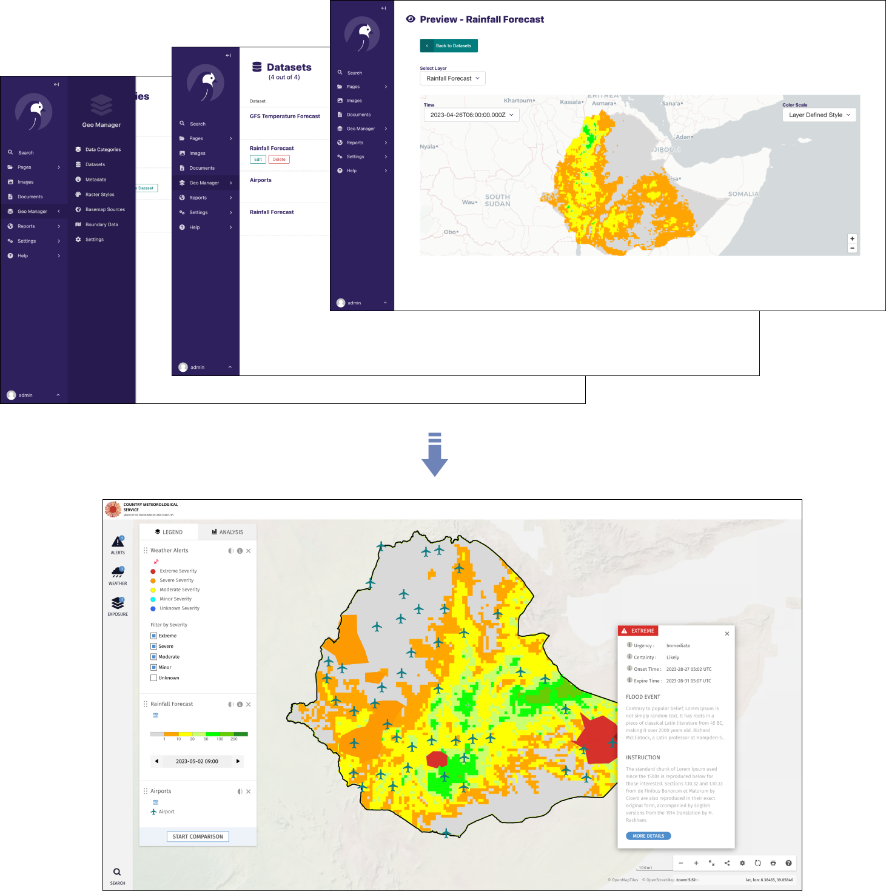

# Geo MapViewer

A dynamic web based online system for visualizing georeferenced data at different geographic levels.

This repository contains the frontend code for the [GeoManager](https://github.com/wmo-raf/geomanager) package.
The GeoManager is the backend system that helps to manage and organize datasets visualized by this mapviewer.


# Getting started

The GeoMapViewer web app is built with [Nextjs](https://nextjs.org/), [React](https://reactjs.org/) and [Redux](https://redux.js.org/).

The app is developed to be deployed alongside the [GeoManager](https://github.com/wmo-raf/geomanager) in one server using [Docker](https://www.docker.com/)

The [GeoManager](https://github.com/wmo-raf/geomanager) is a [Wagtail](https://github.com/wagtail/wagtail) application that is installed
in a Wagtail Project. This means you need to have a Wagtail Project up and running and install the [GeoManager](https://github.com/wmo-raf/geomanager)
package first. 

Below are the steps to get your started:

- Have a Wagtail project up and running. If starting from scratch, you can use the sample project at [https://github.com/wmo-raf/geomanager/tree/main/sandbox](https://github.com/wmo-raf/geomanager/tree/main/sandbox) to get you started.
- Install the Geomanager package in your wagtail project. Follow the instructions at [GeoManager](https://github.com/wmo-raf/geomanager)
- Follow the instructions below to install and run the web app

## Installing the app

Clone the repo:

```bash
$ git clone https://github.com/wmo-raf/geomapviewer.git
```

Installing dependencies:

```bash
$ yarn
```

Copy the `.env.sample` to `.env`, and start the server:

```bash
$ yarn dev
```

The app should now be accessible on [http://0.0.0.0:3000](http://0.0.0.0:3000).

## Configuration

The following are the environmental variables that you can update in your `.env` file

- CMS_API=
- ANALYTICS_PROPERTY_ID=
- GOOGLE_CUSTOM_SEARCH_CX=
- GOOGLE_SEARCH_API_KEY=
- BITLY_TOKEN=

The `CMS_API ` is the url to the Wagtail project instance described above (with Geomanager installed). This should be in form `http://<ip_or_domain>/api` without trailing slash. For example `http://127.0.0.1:8000/api`

## Production Deployment

The application is developed to be deployed together with the Wagtail Geomanager component. You can deploy this together using `docker-compose` with `nginx` as a reverse proxy.


# Documentation
TODO